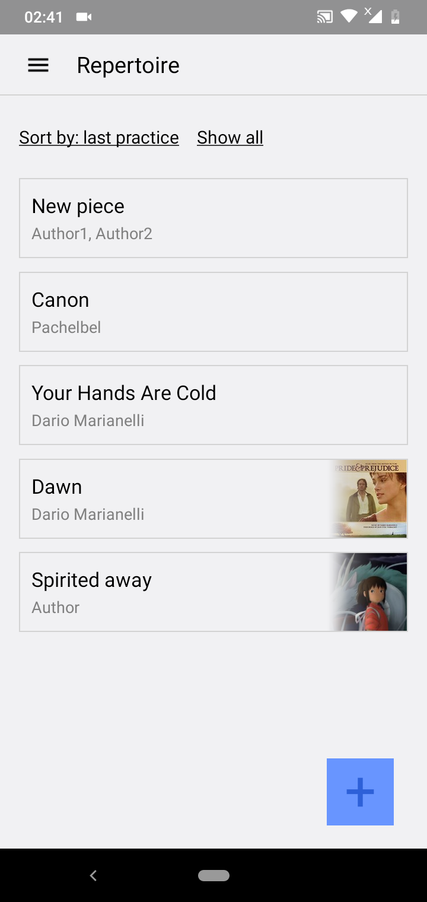
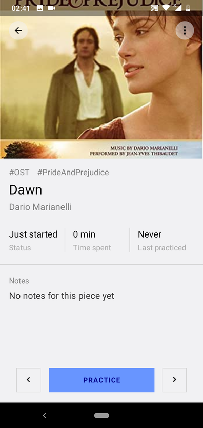
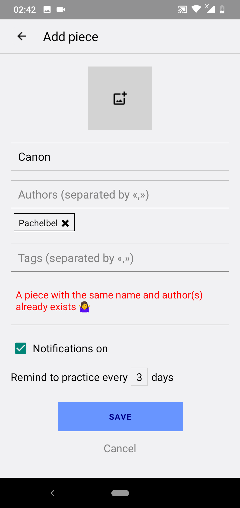
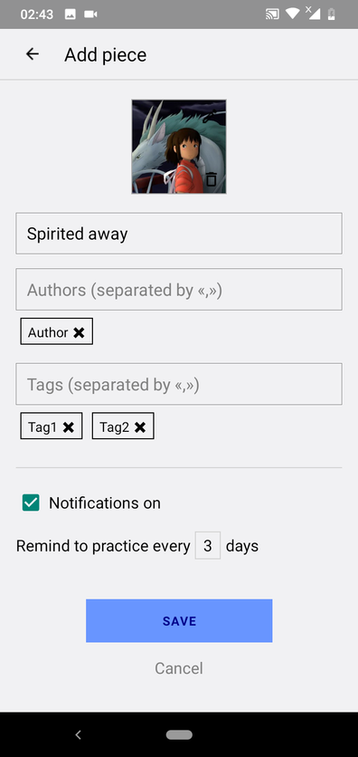
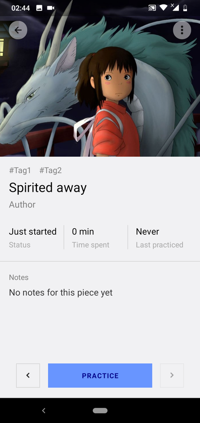
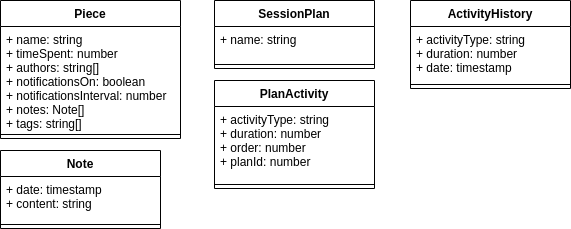

# Music practice helper

------

A mobile app for musicians helping organize practice sessions, maintaining their repertoire and  track time spent practicing.

## Lab2

- Repertoire (pieces list)

- Piece screen

- Piece form: title validation (checks for piece with same title and author) 

- Filled out piece form

- Result

## Minimum plan:

- repertoire (pieces list); storing notes & time spent on each piece, notifications for recital;
- custom session plan builder;
- tracking time spent on practice & displaying statistics;

## Maximum plan:

- machine learning based recommendations on what to play next;
- sync with Musescore account;

## Class diagram:

## Technologies:

- React Native, framework for building mobile apps using components;
- Expo, React Native framework for easier testing and deployment;
- SQLite, Expo and RN - compatible local database;
- Redux - library helping managing the states;
- (for maximum plan): Node.js, possibly Koa;
 
