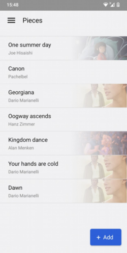
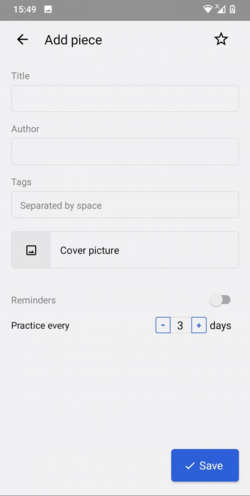
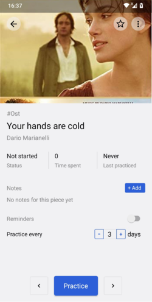
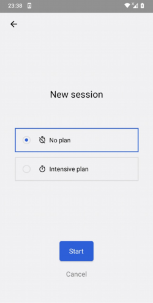
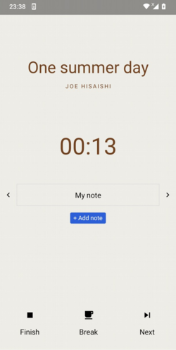
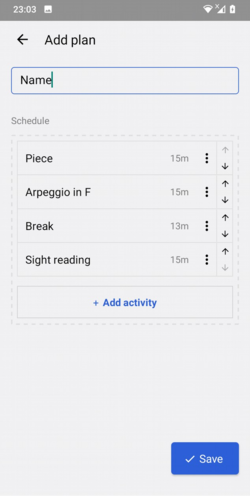
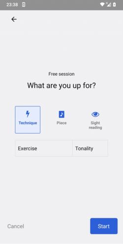
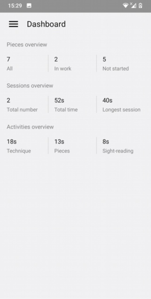
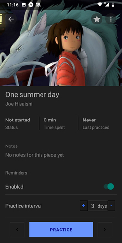

# PracticeTime - music practice manager

Android app for musicians helping to practice effectively.

[Open via Expo](https://expo.io/@kamennova/practiceManager)

#### List you repertoire

For each added piece you can store notes, set up reminders to practice and track level of mastery and time spent.

  

#### Organize practice sessions

 

Two types of sessions are available:
* Planned
* Free

To have a planned practice session, create a plan with activities you want to practice.

In free session, select activities you want to practice on the go.

  

#### View statistics

A complete overview of your practice is available:
* Pieces - partitioned by status - not started, in work and total
* Sessions - total sessions completed, total time spent and the longest session time
* Activities - time spent on Pieces, Technique and Sight reading

#### Choose preferred theme

Dark theme is also available.

---

#### Technologies:

- React Native + Expo
- SQLite
- Redux + Redux Thunk
- Jest 
